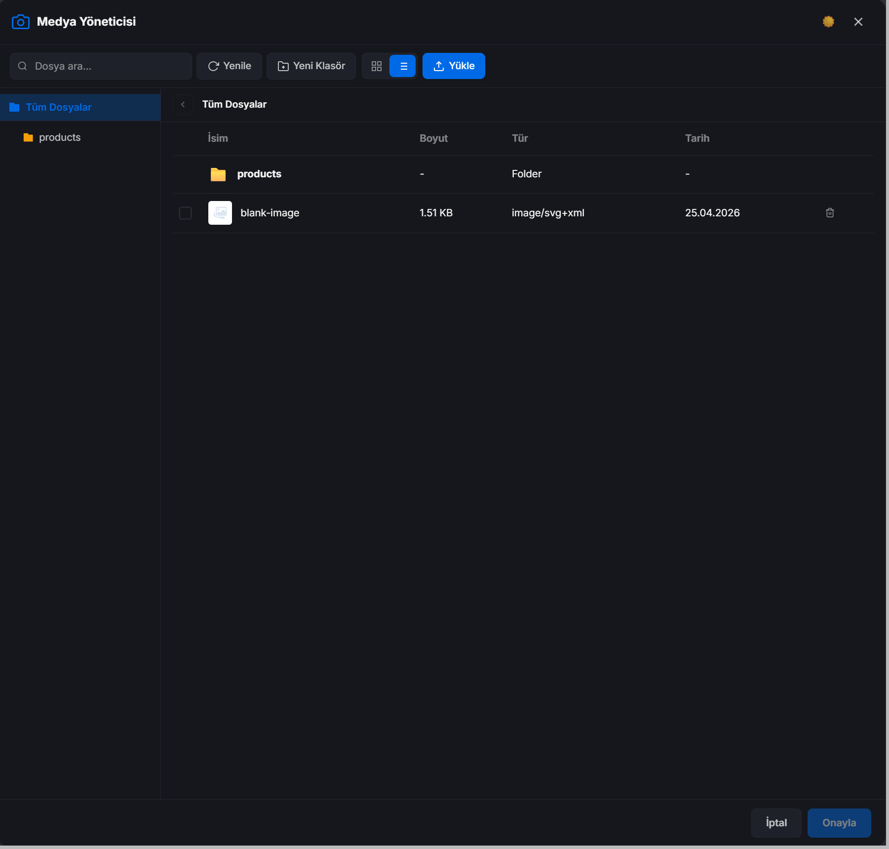

# Laravel Media Manager



[📁 View more screens and demos](./screen)

A production-ready, reusable Laravel package with a modern, WordPress-like media manager modal. Built with Vue 3 and powered by Spatie Laravel MediaLibrary.

## Features

- **Spatie Integration**: Seamless backend file management using Spatie MediaLibrary.
- **Modern UI**: Clean, responsive Vue 3 components with light and dark mode support.
- **Standalone Build**: Zero frontend dependencies required. Packaged as a drop-in IIFE script.
- **Virtual Folders**: Organize files into hierarchical folders (stored in database).
- **Image Processing**: Automatic conversions (thumb, medium, large) and WebP generation.
- **Infinite Scroll**: Smoothly browse large media collections.
- **Multi-select**: Support for single or multiple file selection with configurable limits.
- **Drag & Drop**: Effortless file uploads via drag-and-drop.
- **Theme-agnostic**: Self-contained CSS with custom properties that adapt to any admin theme.

## Installation

1. Add the package to your `composer.json`:
   ```bash
   composer require yazilim360/laravel-media-manager
   ```

2. Publish the assets (REQUIRED for the frontend to work):
   ```bash
   php artisan vendor:publish --tag=media-manager-assets --force
   ```

3. Run the database migrations (creates all necessary tables automatically):
   ```bash
   php artisan migrate
   ```

4. (Optional) Publish configuration and views if you need to customize them:
   ```bash
   php artisan vendor:publish --tag=media-manager-config
   php artisan vendor:publish --tag=media-manager-views
   ```

## Usage Methods

There are two main ways to use this package, depending on how much control you need over your frontend.

### Method 1: Using the Blade Component (Easiest)
If you want a quick plug-and-play button, simply drop the provided Blade component anywhere in your views. It will automatically load the required CSS/JS from the `public/vendor` directory and render a trigger button.

```blade
<x-media-picker 
    :multiple="true" 
    :max="5" 
    button-text="Select Images" 
    on-select="myCallbackFunction" 
/>
```

Then handle the callback in your JavaScript:
```js
function myCallbackFunction(selectedFiles) {
    console.log('User selected:', selectedFiles);
}
```

### Method 2: Manual JavaScript API (Advanced Customization)
If you have your own custom UI (e.g., an existing image input in your admin theme) and don't want to use the `<x-media-picker>` component, you can trigger the Media Manager entirely via JavaScript.

**Step 1:** Include the CSS, JS, and the mounting `div` somewhere on your page:
```html
<!-- Include Assets -->
<link rel="stylesheet" href="{{ asset('vendor/media-manager/media-manager.css') }}">
<script src="{{ asset('vendor/media-manager/media-manager.js') }}" defer></script>

<!-- Required Root Div for Vue to mount to -->
<div 
    id="media-manager-root" 
    data-translations='@json(trans("media-manager::media-manager"))'
    data-config='@json(config("media-manager"))' 
    style="display:none;"
></div>
```

**Step 2:** Bind the API to your custom button:
```html
<button type="button" class="my-custom-edit-button">
    Edit Avatar
</button>

<script>
document.addEventListener('DOMContentLoaded', function () {
    const editBtn = document.querySelector('.my-custom-edit-button');

    if (editBtn) {
        editBtn.addEventListener('click', function (e) {
            e.preventDefault();

            window.MediaManager.open({
                multiple: false,
                types: ["image"], // only allow images
                sidebar: true,    // dynamically show/hide sidebar
                theme: 'dark',    // dynamically set theme ('light' or 'dark')
                locale: 'tr',     // dynamically set language ('en' or 'tr')
                onSelect: function (selectedFiles) {
                    console.log('Selected File Details:', selectedFiles);
                    // Update your custom UI here
                }
            });
        });
    }
});
</script>
```

### TinyMCE Integration
You can easily use the Media Manager as the central file picker for TinyMCE. Just use the `file_picker_callback` option in your TinyMCE initialization:

```js
tinymce.init({
    selector: '#my-editor',
    plugins: 'image media link',
    toolbar: 'image media link',
    file_picker_callback: function (callback, value, meta) {
        // Determine allowed types based on what button was clicked in TinyMCE
        let allowedTypes = ['image', 'video', 'document'];
        if (meta.filetype === 'image') allowedTypes = ['image'];
        if (meta.filetype === 'media') allowedTypes = ['video'];

        window.MediaManager.open({
            multiple: false,
            types: allowedTypes,
            onSelect: function (files) {
                if (files.length > 0) {
                    // Pass the URL back to TinyMCE
                    callback(files[0].url, { alt: files[0].name });
                }
            }
        });
    }
});
```

## Development & Building

If you are modifying the package's Vue components and need to rebuild the `dist` files, use the dedicated Vite library configuration. 

From the root of your package directory:
```bash
npx vite build -c vite.config.js
```
This will compile everything (including Vue and Axios) into a standalone drop-in IIFE script inside the `dist` folder.

## Configuration
The `config/media-manager.php` file allows you to customize storage:

```php
return [
    'disk_path' => 'media-manager', // Path on disk
    'sidebar'   => true,             // Sidebar default visibility
    'default_view' => 'grid',        // 'grid' or 'list'
    'allowed_locales' => ['en', 'tr'], // Supported languages
    // ...
];
```
